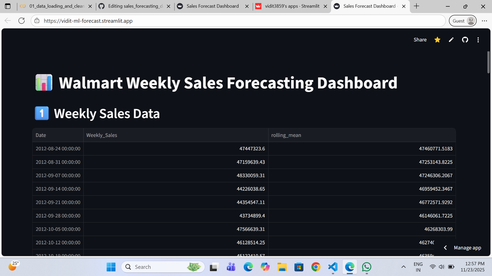
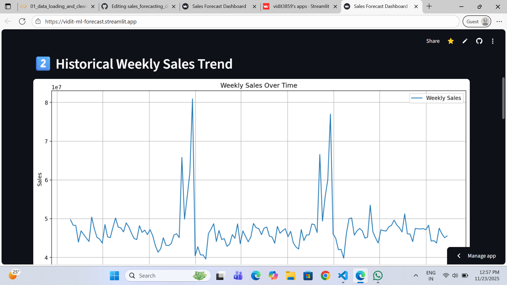
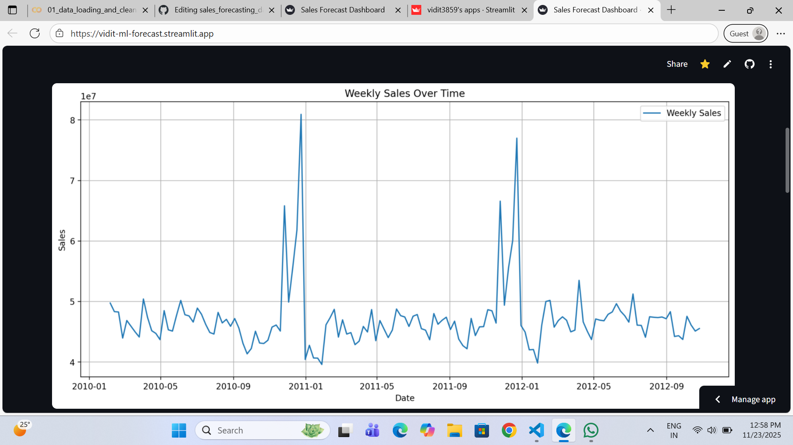
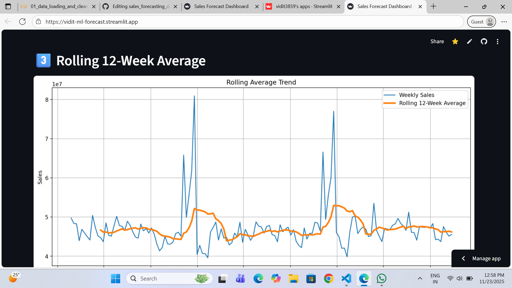
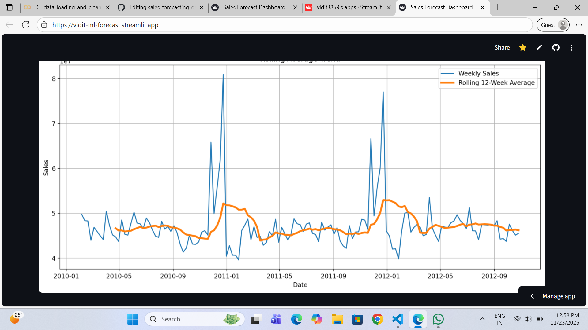
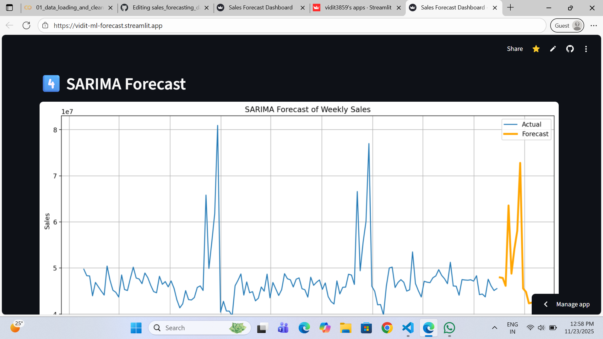
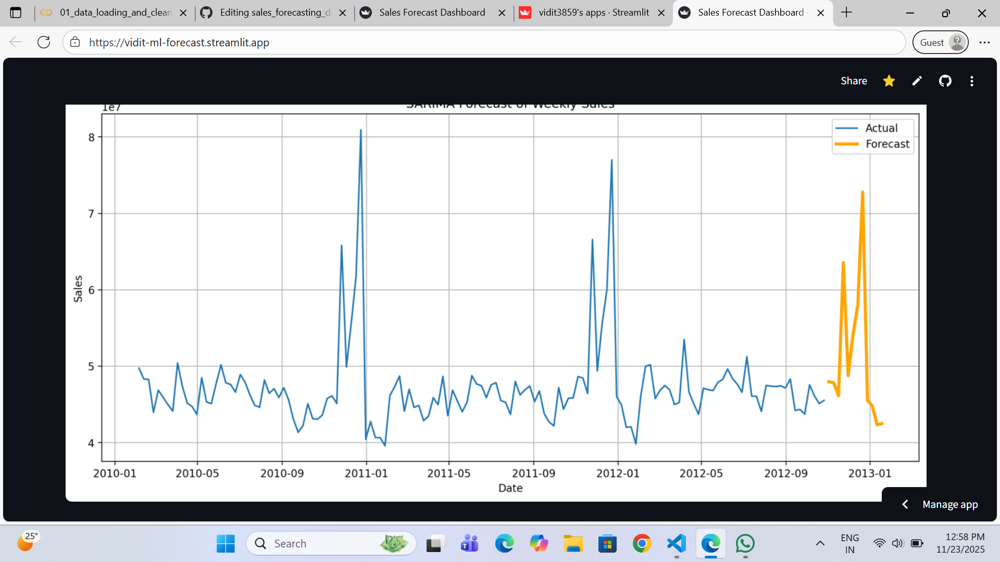
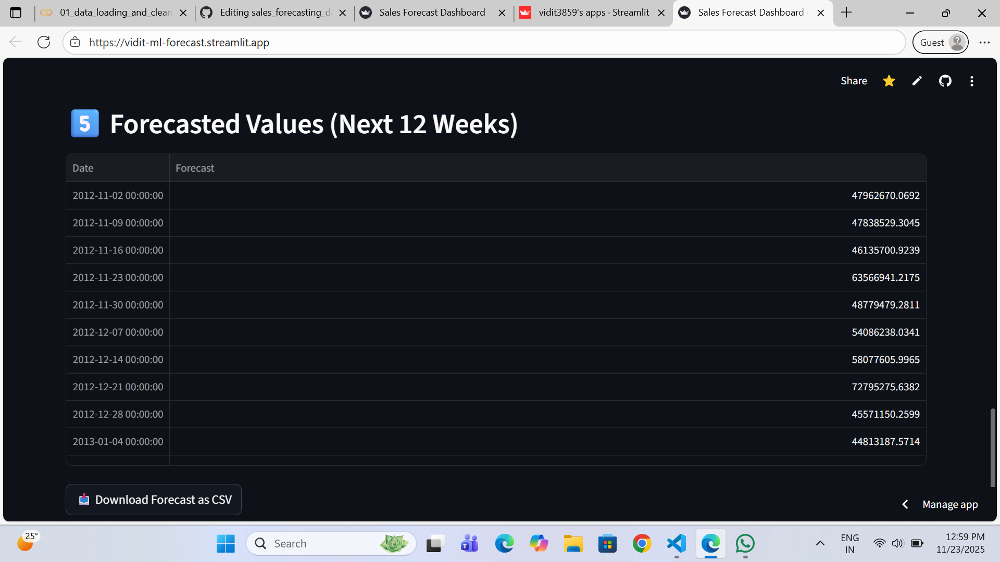

# 📊 AI-Powered Sales Forecasting Dashboard

## ⏳ Time-Series Forecasting • 📉 SARIMA Model • 🌐 Streamlit App • 🛒 Walmart Sales Data

This project predicts future weekly retail sales using real historical data and provides an interactive dashboard built with Streamlit.
It includes full data preprocessing, sales trend analysis, time-series modeling (SARIMA), forecasting, and deployment.

### 🔗 Live Demo: https://vidit-ml-forecast.streamlit.app
### 🔗 Dataset: Walmart Weekly Sales Dataset (Kaggle)


---

## 🚀 Project Features

### ✅ 1. Data Processing & Cleaning

• Convert dates to datetime format

• Sort weekly data chronologically

• Handle missing values

• Aggregate sales by date


### ✅ 2. Data Visualization

• Line plots of weekly sales

• Rolling 12-week average trend

• Seasonal decomposition (trend, seasonality, residuals)


### ✅ 3. Time-Series Forecasting (Modeling)

• SARIMA (1,1,1)(1,1,1,52)

• 12-week future forecast

• Model diagnostics & evaluation

• MSE, RMSE, MAE metrics


### ✅ 4. Dashboard (Streamlit)

• Interactive sections include:

📅 Weekly Sales Table (with rolling mean)

📈 Actual vs Forecasted Sales Chart

🔮 Future Predictions Table

• Responsive & clean layout


---

## 🗂️ Project Structure

```md
sales-forecasting-dashboard/
│
├── app.py                # Streamlit dashboard
├── weekly_sales.csv      # Cleaned dataset (exported from Colab)
├── forecast.csv          # SARIMA model forecast (exported from Colab)
├── requirements.txt      # Required dependencies
└── README.md             # Project documentation
```


---

## 🧠 Modeling Approach

### 🟦 SARIMA Model

• I used a Seasonal ARIMA (SARIMAX) model with weekly seasonality (52 weeks).
Model configuration:

```python
order = (1, 1, 1)
seasonal_order = (1, 1, 1, 52)
```

### 📈 Forecast Output

• The model predicts 12 weeks ahead, generating a clean forecast used in the Streamlit dashboard.


---

## 🛠️ Tech Stack

### Category	Tools:

• Programming	Python

• Data Handling	Pandas, NumPy

• Visualization	Matplotlib

• Time-Series Modeling	Statsmodels (SARIMAX)

• Cloud Notebook	Google Colab

• Dashboard	Streamlit

• Deployment	Streamlit Cloud

• Version Control	GitHub


---

## ▶️ How to Run the Project Locally

### 1️⃣ Clone the repository

```bash
git clone https://github.com/your-username/sales-forecasting-dashboard.git
cd sales-forecasting-dashboard
```

### 2️⃣ Install dependencies

```bash
pip install -r requirements.txt
```

### 3️⃣ Run Streamlit

```bash
streamlit run app.py
```


---

## 🌐 Deployment (Streamlit Cloud)

The project is deployed on Streamlit Cloud.

### Key steps:

1. Upload project folder to GitHub


2. Go to https://streamlit.io/cloud


3. Deploy → Select GitHub repo


4. Choose app.py as the entry point


5. Add environment file (requirements.txt)


6. Deploy & get a public URL


---

## 📸 Dashboard Preview











---

## 📉 Results

• The SARIMA model successfully forecasts 12 weeks of sales

• Rolling averages reveal seasonal patterns

• Dashboard provides intuitive visual insights

• RMSE and MAE validate model performance


---

## ⭐ Future Improvements

• Add Facebook Prophet / NeuralProphet models

• Add advanced EDA with store-wise or department-wise charts

• Add interactive filters in Streamlit

• Add anomaly detection on unusual sales spikes


---

## 🤝 Contributing

• Pull requests, suggestions, and forks are welcome!

• Feel free to open an issue if you'd like to improve the dashboard.


---

## 📬 Contact

### Vidit Kumar
#### 📧 Email: vidit.kumar624@gmail.com
#### 🌐 LinkedIn: linkedin.com/in/viditkumar-in


---
